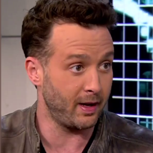

# gen-adv-talking-head
CV Course Project

## Team Members

- Jyotin Goel
- Ashutosh Kumar
- Shivam Khanchandani

## Demo

### Source Image


### Driving Video (GIF)


### Generated Talking Head (GIF)


## Training Recipe

Train on VoxCeleb Config

```bash
CUDA_VISIBLE_DEVICES=0,1 python -m torch.distributed.launch --master_addr="0.0.0.0" --master_port=12348 gan_talk_head/run.py --config gan_talk_head/config/vox-adv-256.yaml --name DaGAN --rgbd --batchsize 12 --kp_num 15 --generator DepthAwareGenerator
```

To get VoxCeleb Config, kindly refer to [Video Preprocessing](https://github.com/AliaksandrSiarohin/video-preprocessing) or [Vox Celeb Pre process](https://github.com/StelaBou/voxceleb_preprocessing?tab=readme-ov-file).

Or Do your own processing by getting the videos from VoxCeleb -> using a Face detector to crop the faces from the videos for talking head synthesis.
